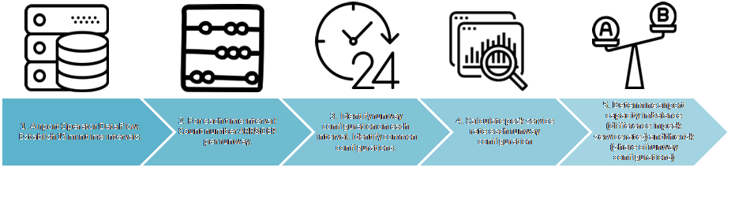

```{r setup, include=FALSE}
knitr::opts_chunk$set(echo = TRUE)
```

# Introduction

```
teaser / motivation
```
The recent years have seen a political for action to address the capacity shortages.
The Growth Study <reference> similar to ACI's Director General [@jankovec_2018] point out that the airport capacity crunch is one of the major challenges for the growth of air transporation within the European context.

```
nature of problem
```
Airport capacity is a multi-facetted topic and there exists no single commonly agreed definition. 
In general, capacity refers to the ability of a system to satisfy demand.
However already this view can be constraint by political goals. For example, xxx defines capacity as a tuple of A, B, C.
Different factors (c.f. [@mota_etal_2017]).
An example of a politically motivated cap is Amsterdam Schiphol. In other airports such limits are expressed in terms of passengers served.
The operational capacity of an airport is determined therefore by both subsystems, i.e. airside and landside. 
Airport airside capacity is determined by a combination of the infrastructure elements, i.e. apron, taxiway, and runway system, existing operational practices and procedures, and associated constraints (e.g. noise abatement, environmental protection, night curfew).

```
high-level goals/objectives - other relevant work - purpose/significance of paper
```
<< ... >>
Among all factors affecting the runway system capacity, the runway configuration is considered as the most relevant. While some airport layouts allow for very similar operation conditions in one runway configuration or another, resulting in equal or similar capacities for all possible runway configurations, other layouts do not offer that “symmetric capacity” as the different configurations might have very different operating conditions, dependencies and limitations.


```
method by which problem is approached
```
This study applies an empirical data-driven approach and analyses the potential imbalance in capacity depending on the runway configuration for a subset of European airports.
The work builds on the post-operational data collection by the Performance Review Unit.

<<...>>

```
contribution
```
The contribution of this paper are as follows:

* conceptual modelling of the analysis problem
* proposed identification method of runway configurations for post-operational performance data analyses;
* ...


# Background

Runway configurations are given in the following notation: (R1,R1 | R2) [@avery_2015; @ramanujam_2015]. 
The runway configuration can also play an essential role in the recovery from disruptions [@koelle_2015].

## Aerodrome - Runway System Characterisation

(ref:EHAM-aerodrome-layout) Aerodrome chart for Amsterdam Schiphol (EHAM).

```{r EHAM-aerodrome-layout, fig.cap='(ref:EHAM-aerodrome-layout)', fig.pos='hbt', fig.height = 4}

```

Amsterdam Schiphol (EHAM) represents one of the most complex aerodrome layouts in Europe (c.f. Fig. \@ref(fig:EHAM-aerodrome-layout)).


# Method / Approach

(ref:rwy-config-analysis-approach) Steps of analysis.

```{r rwy-config-analysis-approach, fig.cap='(ref:rwy-config-analysis-approach)', fig.pos='hbt', fig.height = 4}

```

Fig. \@ref(fig:rwy-config-analysis-approach) depicts the overall approach.

# Results

# Conclusions

```
1. What is shown by this work and its significance.
```

```
2. Limitations and advantages.
```

```
3. Applications of the results.
```

```
4. Recommendations for further work.
```

# References
